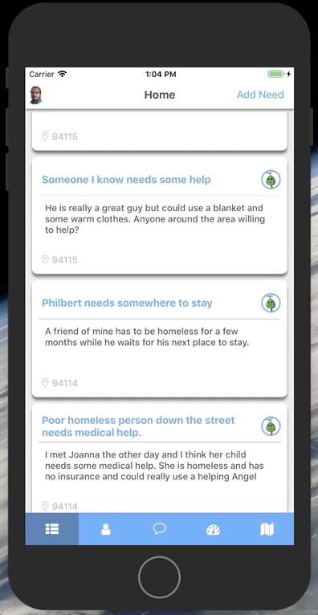
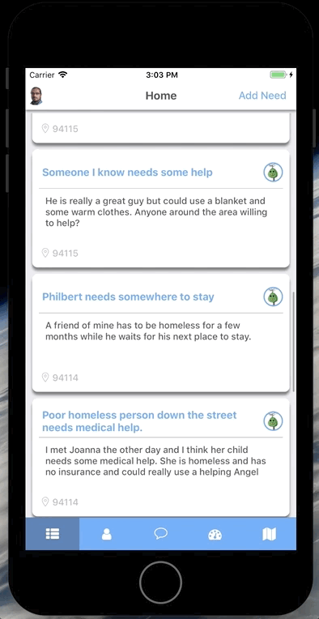
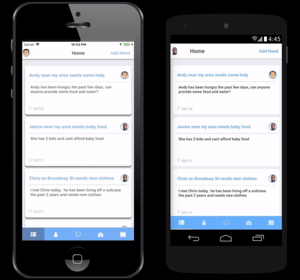
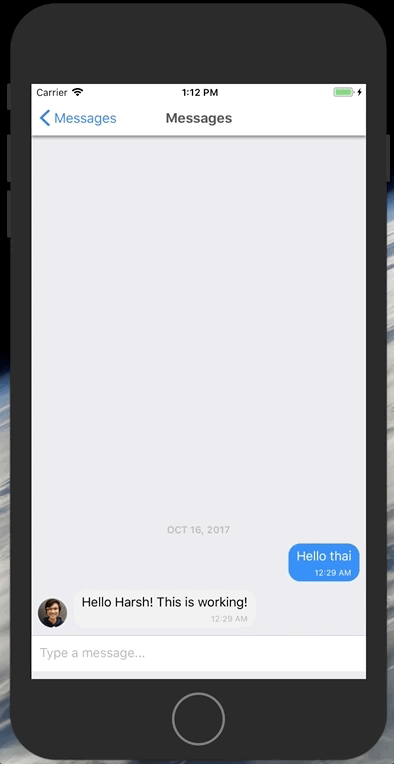
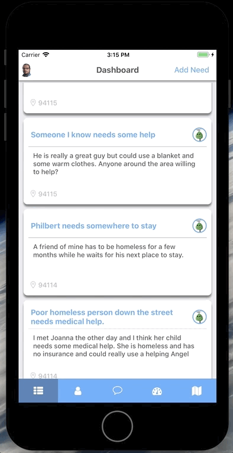

# Guardian Angel

### [Check out the Guardian Angel Live Website!](http://guardianangel.website)

## Background and Overview

Have you ever met someone in need but did not have the knowledge or resources to help them?
Have you ever wanted to help someone but did not know who to approach?

Guardian Angel is a social network that connects these kinds of people together.
You can be a Guardian, and partake in community outreach, finding the people in your area in need and listing them on the app.
You can be an Angel, who can scroll through the Needs Feed and provide the help someone needs.

Guardian Angel aims to crowd source pro-bono services to those in need, using the technology in our hands to reach out to those who don't have access to it.

## Technologies Involved

This project was built using the following technologies:
* Frontend
  * React Native / Redux
  * <a href="https://github.com/expo/expo">Expo</a>
  * Apollo GraphQL <a href="https://github.com/apollographql">link</a>
  * <a href="https://github.com/FaridSafi/react-native-gifted-chat">GiftedChat</a>

* Backend
  * NodeJs / Express
  * MongoDB
  * Mongoose
  * GraphQL

## Needs Feed



The Home Feed displays all the current needs that are in the area. Users can view these needs directly and offer their services.



## Profile



The User Profile page displays all the users posted needs and a button to message them directly.

## Messages



Messages are sent in real-time and implemented using WebSockets. Users can message other users to get more information about needs. In GraphQL `users` are joined with two seperate entities: `conversations` and `messages`.

`conversations` involve an author and recipient and act somewhat like a SQL joins table to allow for consolidating specific message queries. `messages` house the text data and connect these messages to one specific user and conversation.

an example query to fetch conversations message in GraphQL:
```
  getConversationMessages: async (_, { _id }, { user }) => {
    try {
      await requireAuth(user);
      return Message.find({ conversation: _id }).sort({ createdAt: -1 });
    } catch (error) {
      throw error;
    }
  },
 ```
 These messages are then attached to a `PubSub` instance generated using the `graphql-subscription` library to allow us to hook up our frontend to the websockets. Subscriptions exist for conversations and for individual messages inside them. Some example code how our conversation joins a subscription inside our
`conversation-resolvers.js`

In the create conversation we will publish the data and subscribe the user
```
 pubsub.publish(CONVERSATION_ADDED, { [CONVERSATION_ADDED]: conversation });
```
adding the subscribe functionality
```
  conversationAdded: {
    subscribe: () => pubsub.asyncIterator(CONVERSATION_ADDED)
  }
```

 After the backend is open for subscriptions, the frontend will subscribe the user when they navigate to the messages button or create a new conversation and go to `ConversationIndexScreen.js`.


## Dashboard



The user Dashboard displays all needs the user has posted or applied to, the status of the need, and how many people have offered their service.
