# Guardian-Angel

## Background

There are people in this world that have become disconnected with their community,
livelihood and struggle to reconnect. Our goal is to create an application that
allows users to leverage technology to help these people. By creating a `Need` a
person will be able to connect those that need help with those that want to help.

This application will allow people to network with others to help someone in need.
By generating a need, a user will become a "Guardian" and be able to take in applicant
"Angels". Alongside, a Guardian may also be an Angel themselves and decide to help
someone in need.

The focus of the app will rely heavily on a users own vetting process to decide if
they will want to accept the help, and we will provide location based tools to help.
We feel that by creating an easy user experience to organically explore how to help or get someone some help, the world can be a little better than when we started.

## Technologies & Technical Challenges

- Backend:
  - Node JS
  - Express
  - MongoDB or PostgresSQL
  - GraphQL
  - JSON Web Tokens (JWT)

- Frontend:
  - React Native
  - Redux
  - JavaScript
  - Apollo

#### API
- Setup the models using MongoDB or PostgresSQL.
- User GraphQl to setup the Schema, and request types Mutation and query as an entry point into the database, so that we can send the data that we need to the front end
- Use JWT for user authentication(login, logout, signup, and giving session token) and secure the API.

#### FrontEnd
- Use React native to build our mobile App.
- Use Redux to keep our state for rendering
- User GraphQL to query to the API and get what we need.
- Use Apollo to get the response which has the data we need from the API
- Secure the front end by keeping identify the current user from the Redux store

## Functionality & MVPS
With this app users will be able to:
1. View an index of NEEDS
2. View a map of a zip code and see NEEDS in that area.
3. See a Dashboard of their currently created NEEDS
4. View a list of messages started with potential ANGELS
5. Carry on a direct message with another User.
6. (BONUS) Endorse other users
7. (BONUS) Follow other users.
8. (BONUS) Utilize D3 for user and zone statistics

## Group Members and Work Breakdown

#### Day 0 (sunday):
We all completed a tutorial on React Native to become familiar with it, along with started tutorials
on spinning up and application with React Native and Node with Mongo.
Alongside we will meet up to decide upon how we will divide the workload to maximize our learning and decide upon
what kind of back end we will want to use and if we will do all new technologies.

#### DAY 1: Basic File Structure set up and begin back-end and front-end - Pair Programming

Tyler: Responsible for setting up the back end for `Users` and auth. Alongside, pair-program with Thai to set up
the back end file structure and continue to work through understanding mongo and graphql.

Thai: Responsible for setting up the back end for `Locations` and `Tags` and pair program with Tyler to set up the
back end file structure.

Harsh: Will pair program with Clay setting up the base front end file structure and begin the views for `Needs`.
Feed and profile needs index.

Clay: Will work with Harsh setting up the base front end file structure and begin the views for `Messages` index
and show and research websockets.

#### DAY 2: Finish Pairs back/front end work, Start on other side - Pair Programming

Tyler: Finalize models and API for `Users` and auth and set up cloudinary and begin Dashboard views if enough time.

Thai: Finalize `Location` and `Tags` models and begin setting up views including maps api research

Harsh: Round out general views for `Needs` Index and will pair program with Clay to set up the models

Clay: Round out the views for `Messages` and have good placeholders, finalize websocket research and try to
implement a sample and pair program with Harsh to start the corresponding models and begin the apis.

#### DAY 3: Putting together the pieces - Hooking up the back end to the front for each feature

Tyler: User, Dashboard/profile, show pages have functioning calls the back end and data is curated correctly.
and should have the ability to hook up corresponding `Needs`

Thai: Have an up and running map and should be able to have access to the `Needs` for his views.

Harsh: Be able to hook up his needs and have the corresponding data views available for consumption along with
a working Feeds page.

Clay: Have the messages be able to update to the index and show pages and possibly set up notifications.

#### DAY 4: Catch Up & Styling
This day should also act as a catch up in case we fall behind and hit some nasty bugs

Tyler: Final component styles `User` Dashboard(index) and show pages

Thai: Final component styles `Location` show pages

Harsh: Final component styles `Needs` feed and user feed(?)

Clay: Final component styles `Messages` messages show and index

#### DAY 5: Clean up Lingering Style or bugs & Set Up Demos, Emulator, Splash Page

Tyler: Index.html - CSS

Harsh: gif creation - CSS

Clay: set up background and other graphics needed for the splash page and CSS

Thai: Emulator set up - CSS

## Plan for Getting Users and Reviews
- Each team member will reach out to at least 20 friends and family to download and try the app
- Each team member will post to linkedIn and other social media outlets for more traction.

## Wireframes

### Splash Page
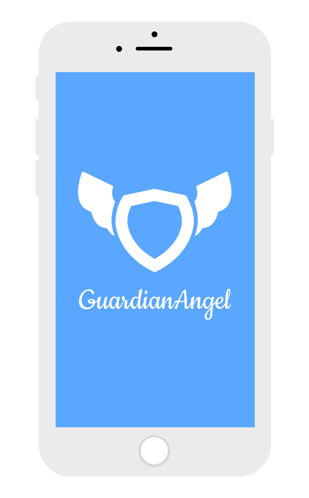
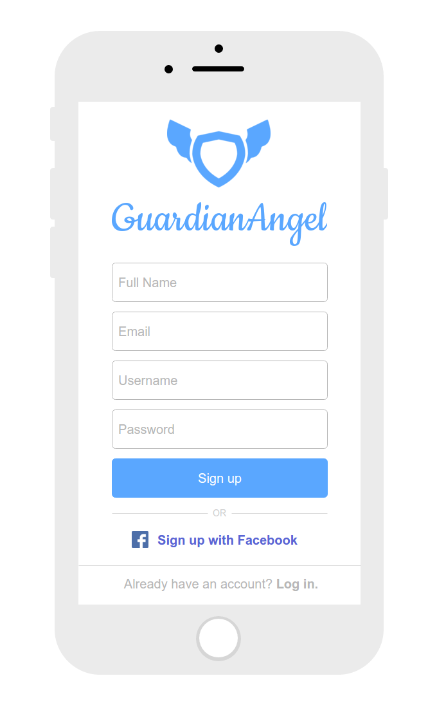
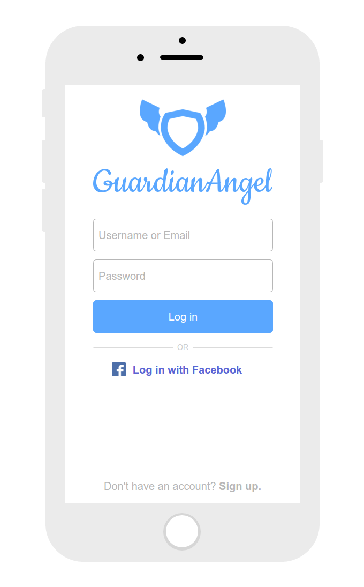
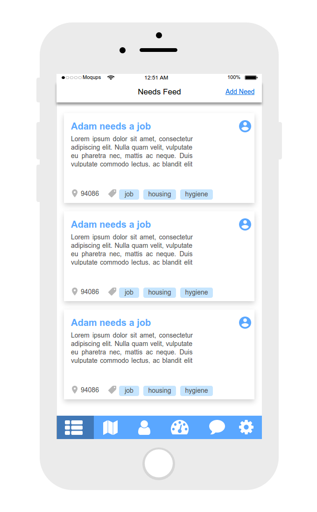
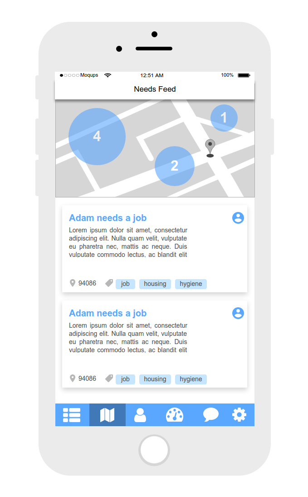
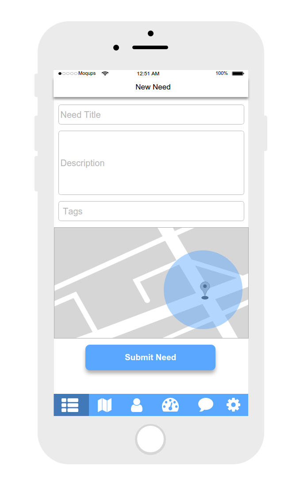
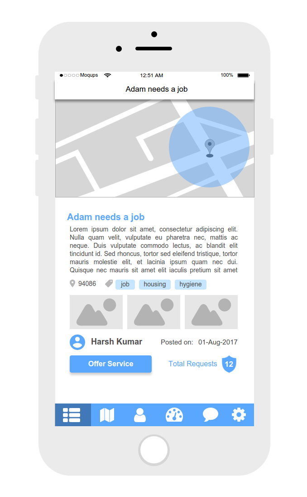
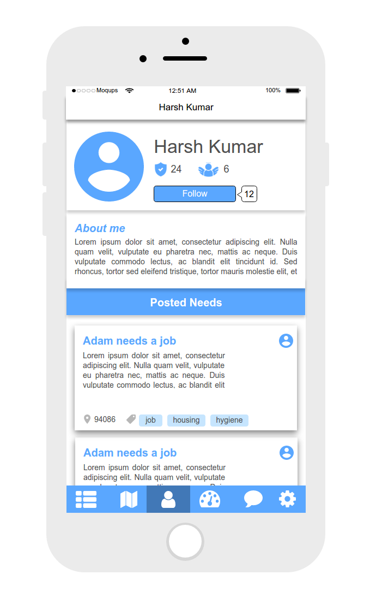
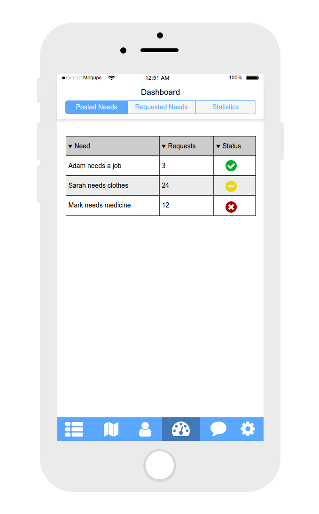
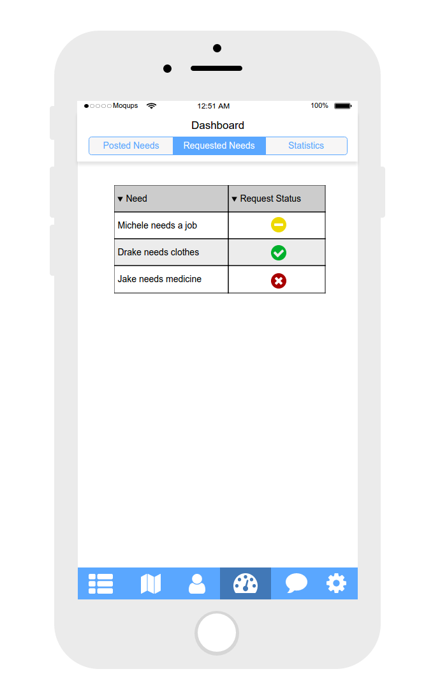
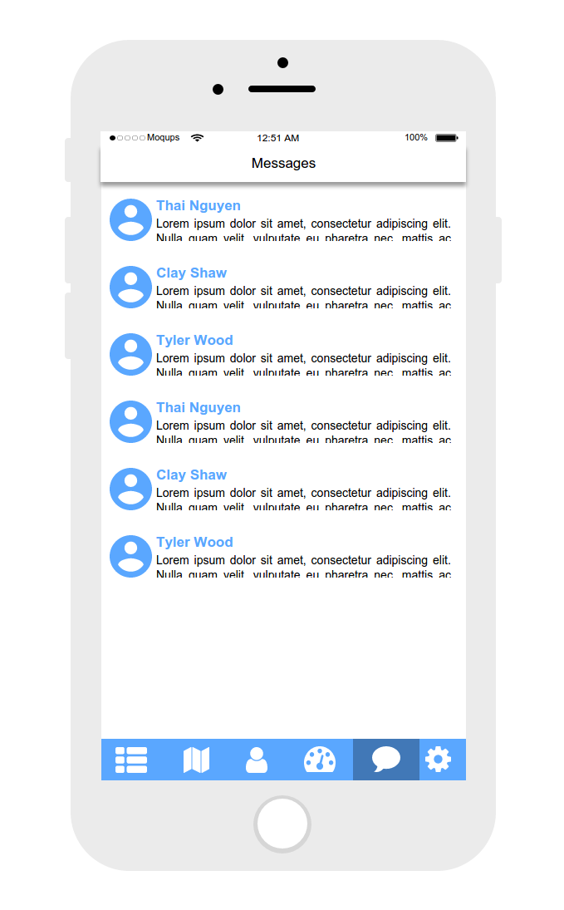
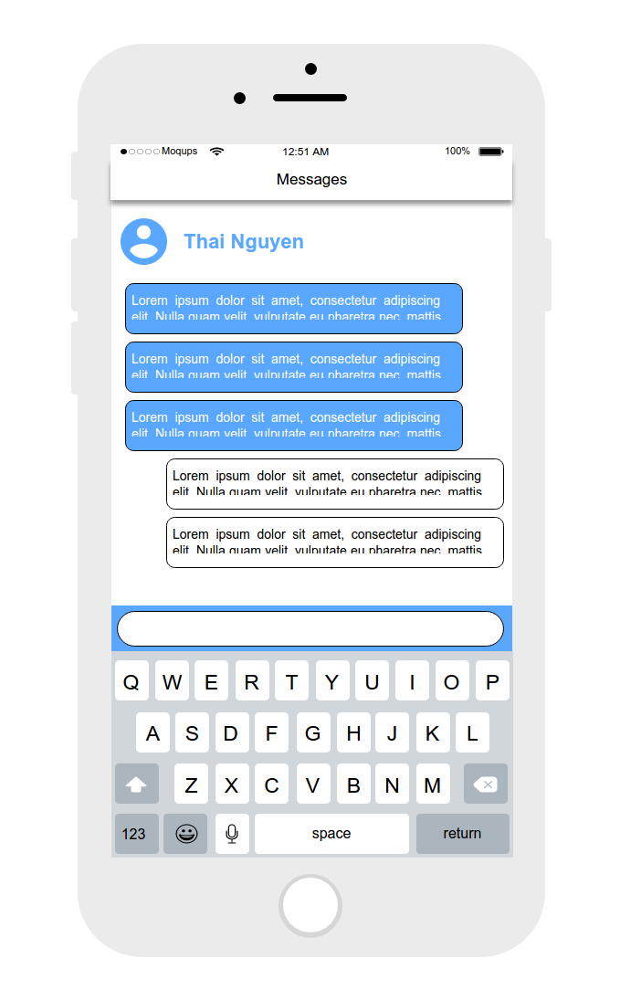
